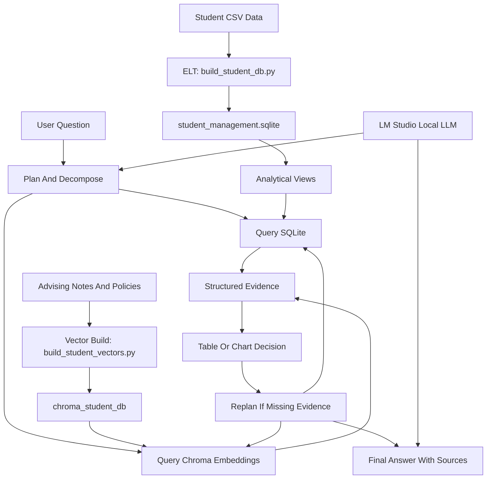

# DESIGN

This project is a local SQLite Agentic RAG sample over Student Management data.

It uses LM Studio through an OpenAI-compatible local chat endpoint, local HuggingFace embeddings, Chroma for vector retrieval, and SQLite for structured data.

---

## 1. Goals

The project is intentionally small and inspectable. It should help demonstrate:

- Repeatable eval runs over fixed question sets.
- Grounded answering that combines structured SQL data and unstructured embedding retrieval.
- A simple agentic workflow with planning, tool use, table/chart output, replanning, and final answer synthesis.
- Local-first operation without hosted model or database services.

---

## 2. SQLite Agentic RAG Sample

The Student Management sample adds a simple ELT layer and a tool-style workflow. It is designed for questions that need both structured facts and policy or advising context.

### Target Architecture

### Data

Structured CSV sources live in `data/student_management/`:

- `students.csv`
- `courses.csv`
- `enrollments.csv`
- `attendance.csv`
- `assessments.csv`
- `fees.csv`

Unstructured retrieval documents live in `data/student_management/docs/`:

- `advising_notes.md`
- `policies.md`
- `course_descriptions.md`

### ELT

`scripts/build_student_db.py` rebuilds `student_management.sqlite` from the CSV files using Python `sqlite3`.

Raw tables remain normalized, while views provide useful analytical surfaces:

- `student_risk_summary` – Average score, attendance, fee balance, risk level, risk reasons, and scholarship flag by student.
- `course_performance_summary` – Average score and attendance by course.
- `attendance_trend` – Monthly attendance percentage by student.
- `assessment_scores`, `attendance_summary`, `fee_summary` – Reusable intermediate summaries.

### Vector Index

`scripts/build_student_vectors.py` chunks the Markdown documents and stores embeddings in `chroma_student_db/`.

### Agent Workflow

`student_agent.py` exposes the workflow as readable functions:

- `plan_question()` – Plans SQL, vector retrieval, and table/chart needs. It uses LM Studio when available and falls back to deterministic keyword plans.
- `decompose_query_request()` – Converts the plan into explicit workflow steps.
- `run_sql()` – Executes one read-only `SELECT` or `WITH` statement against SQLite.
- `retrieve_notes()` – Runs Chroma similarity search over student notes and policies.
- `generate_table_or_chart_spec()` – Creates a Markdown table or Vega-Lite chart spec.
- `replan_if_needed()` – Runs a fallback query if the first SQL plan returns no rows.
- `answer_from_evidence()` – Synthesizes the final answer with LM Studio or a deterministic fallback.

The SQL tool rejects mutating statements before execution. This keeps the sample safe for a local demo while still showing how an agent can use structured data.

---

## 3. Student Eval Flow

`eval/student_questions.json` contains mixed SQL-only, vector-only, hybrid, and chart-style questions.

`eval_student_run.py` writes each result to `eval/student_results.jsonl` with:

- `run_id`
- `id`
- `question`
- `answer`
- `plan`
- `sql`
- `artifact_type`
- `sources`

This makes it possible to compare prompt, model, SQL-planning, or retrieval changes across runs.