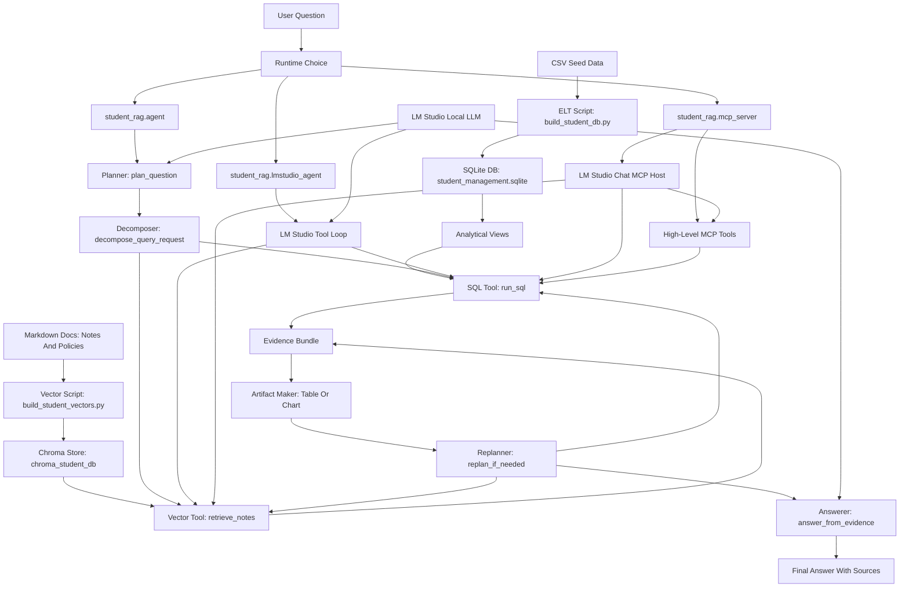
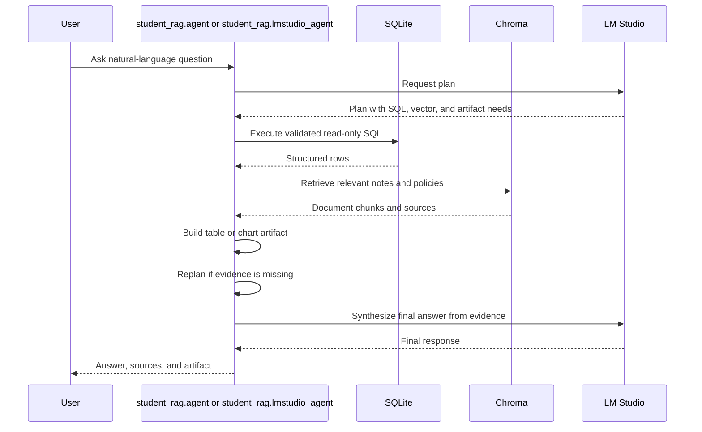
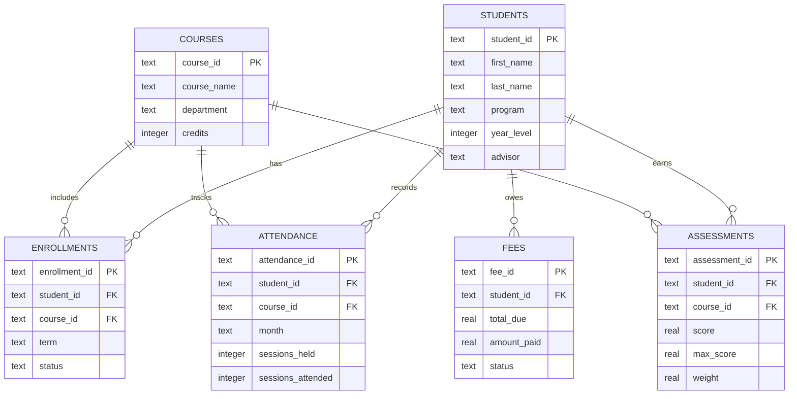

# Design: Student Management Agentic RAG

## 1. Purpose

This project is a small local sample that shows how an agent can answer Student Management questions by combining:

- Structured data from SQLite.
- Unstructured evidence from Chroma embeddings.
- Local answer generation through LM Studio.
- A simple workflow with planning, tool execution, table/chart output, replanning, and final synthesis.

The sample is intentionally lightweight so it can be used as a teaching project or as a base for Cursor or LM Studio agent experiments.

## 2. Scope

In scope:

- Build a local SQLite database from CSV source files.
- Build a local Chroma vector store from Markdown documents.
- Answer natural-language questions with SQL evidence and retrieved document snippets.
- Produce Markdown tables or Vega-Lite chart specs when useful.
- Run repeatable eval questions and append JSONL results.

Out of scope for the first version:

- User authentication.
- Multi-user database writes.
- Hosted vector databases.
- Production scheduling or orchestration.
- Full BI dashboard rendering.

## 3. Target Architecture



## 4. Project Structure

```text
student_management_agentic_rag/
  data/
    student_management/
      *.csv
      docs/
  docs/
  eval/
  scripts/
  src/
    student_rag/
      agent.py
      artifacts.py
      db.py
      llm.py
      lmstudio_agent.py
      mcp_server.py
      paths.py
      retrieval.py
  eval_student_run.py
  pyproject.toml
  requirements.txt
```

## 5. Main Components

### Source Data

Structured CSV files are stored under `data/student_management/`:

- `students.csv`
- `courses.csv`
- `enrollments.csv`
- `attendance.csv`
- `assessments.csv`
- `fees.csv`

Unstructured Markdown documents are stored under `data/student_management/docs/`:

- `advising_notes.md`
- `policies.md`
- `course_descriptions.md`

### SQLite ELT

`student_rag.db` contains the SQLite schema, ELT build function, schema summary, and safe read-only SQL execution. `scripts/build_student_db.py` is a thin command wrapper that rebuilds `student_management.sqlite`.

The raw tables stay normalized. The script also creates analytical views that make agent-generated SQL simpler:

- `assessment_scores`
- `attendance_summary`
- `fee_summary`
- `student_risk_summary`
- `course_performance_summary`
- `attendance_trend`

`get_schema_summary()` includes value hints that are important for local models:

- `student_risk_summary.risk_level` uses text values: `high`, `medium`, `low`.
- `student_risk_summary.scholarship_candidate` uses integer values: `1` means yes, `0` means no.
- `student_risk_summary.term` uses values such as `2026-Spring`; there is no `current_term` value.
- `fee_summary.status` uses text values: `paid`, `partial`, `overdue`.

### Vector Index

`student_rag.retrieval` loads Markdown documents, splits them into chunks, embeds the chunks with `sentence-transformers/all-MiniLM-L6-v2`, and persists them in `chroma_student_db/`. `scripts/build_student_vectors.py` is a thin command wrapper.

### Agent Workflow

`student_rag.agent` contains the deterministic workflow functions:

- `plan_question()` decides whether SQL, vector retrieval, and chart output are needed.
- `decompose_query_request()` turns the plan into explicit workflow steps.
- `run_sql()` validates and executes one read-only SQLite query.
- `retrieve_notes()` performs Chroma similarity search over advising and policy docs.
- `generate_table_or_chart_spec()` returns a Markdown table or Vega-Lite chart spec.
- `replan_if_needed()` runs a fallback query when SQL evidence is missing.
- `answer_from_evidence()` asks LM Studio to synthesize the final answer, with a deterministic fallback when LM Studio is unavailable.

`student_rag.lmstudio_agent` exposes the same project capabilities through LM Studio's OpenAI-compatible tool-calling API:

- `get_schema_summary` gives the model the SQLite tables, views, and columns.
- `run_sql` executes validated read-only SQL.
- `retrieve_notes` searches advising notes, policies, and course descriptions.
- `generate_artifact` builds a Markdown table or Vega-Lite chart spec from the latest SQL result.
- If tool calling fails or reaches the round limit, it falls back to `answer_student_question()`.

`student_rag.mcp_server` exposes the same low-level tools as an MCP server so users can ask questions directly inside LM Studio Chat:

- `ask_student_management`
- `get_schema_summary`
- `run_sql`
- `get_at_risk_students`
- `analyze_at_risk_students`
- `get_scholarship_candidates`
- `analyze_scholarship_candidates`
- `retrieve_notes`
- `generate_artifact`

`ask_student_management` is the default plain-language tool. It routes common risk, scholarship, attendance, course, and fee questions to the right structured and vector evidence internally.

The high-level MCP tools reduce common model mistakes. For example, `get_scholarship_candidates` uses the correct condition `scholarship_candidate = 1` instead of relying on the model to guess whether the flag is `yes`, `true`, or `1`.

The `analyze_*` MCP tools combine structured SQL results with retrieved vector context. They are preferred for LM Studio Chat questions that ask for explanations, reasons, policy support, or next actions.

## 6. Runtime Flow



## 7. Data Model Summary



## 8. Safety Rules

The SQL tool is intentionally conservative:

- Only one statement is allowed.
- SQL must start with `SELECT` or `WITH`.
- Mutating keywords such as `INSERT`, `UPDATE`, `DELETE`, `DROP`, `ALTER`, and `CREATE` are rejected.
- Results are capped by `MAX_SQL_ROWS`.
- SQL results can include warnings for suspicious value usage, such as `scholarship_candidate = 'yes'`.

This keeps the demo safe while still showing how an agent can use structured data.

## 9. Evaluation

`eval/student_questions.json` contains representative questions:

- Student risk and intervention.
- Course performance weak areas.
- Scholarship support eligibility.
- Attendance trend chart generation.

`eval_student_run.py` appends each run to `eval/student_results.jsonl` with the question, answer, plan, SQL, artifact type, and sources.

### Risk Answer Rubric

Risk answers should explain both high-risk triggers and medium-risk indicators.

High-risk triggers:

- `avg_score < 70`
- `attendance_pct < 75`
- `balance_due > 500`

Medium-risk indicators:

- `avg_score < 80`
- `attendance_pct < 85`
- `balance_due > 0`

`risk_reasons` is intentionally focused on high-risk reasons and can be empty for medium-risk students. An answer should not say a medium-risk student has "no reason" only because `risk_reasons` is empty. Instead, it should infer the medium-risk explanation from the metrics.

## 10. Generated Artifacts

These files are generated locally and ignored by git:

- `student_management.sqlite`
- `chroma_student_db/`
- `eval/student_results.jsonl`
- `__pycache__/`