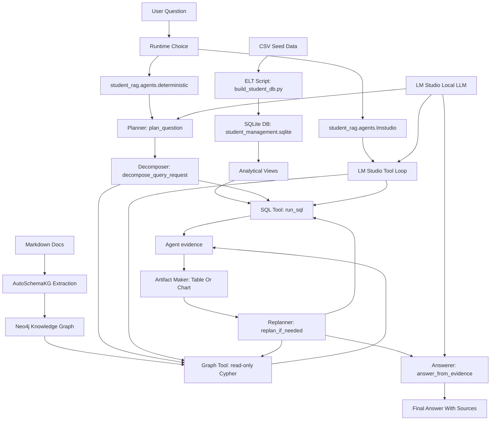
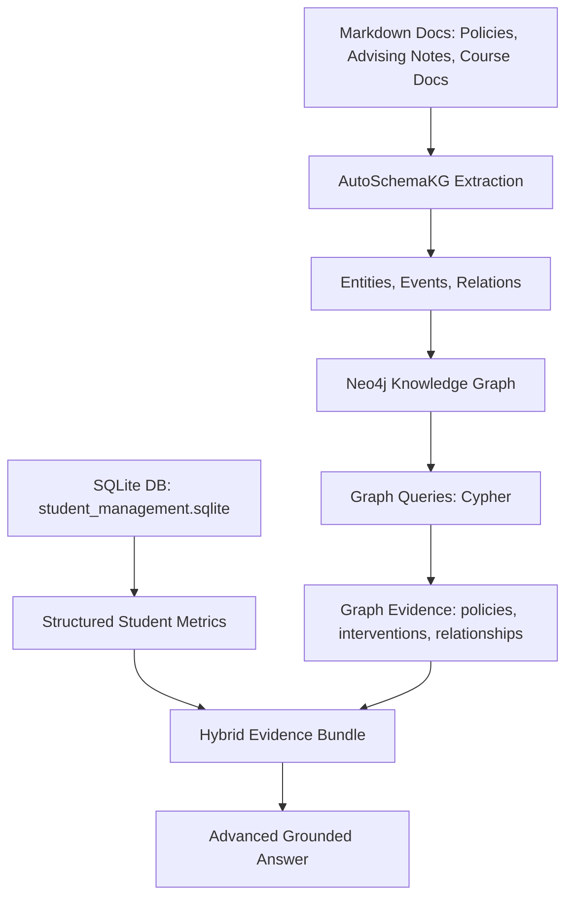
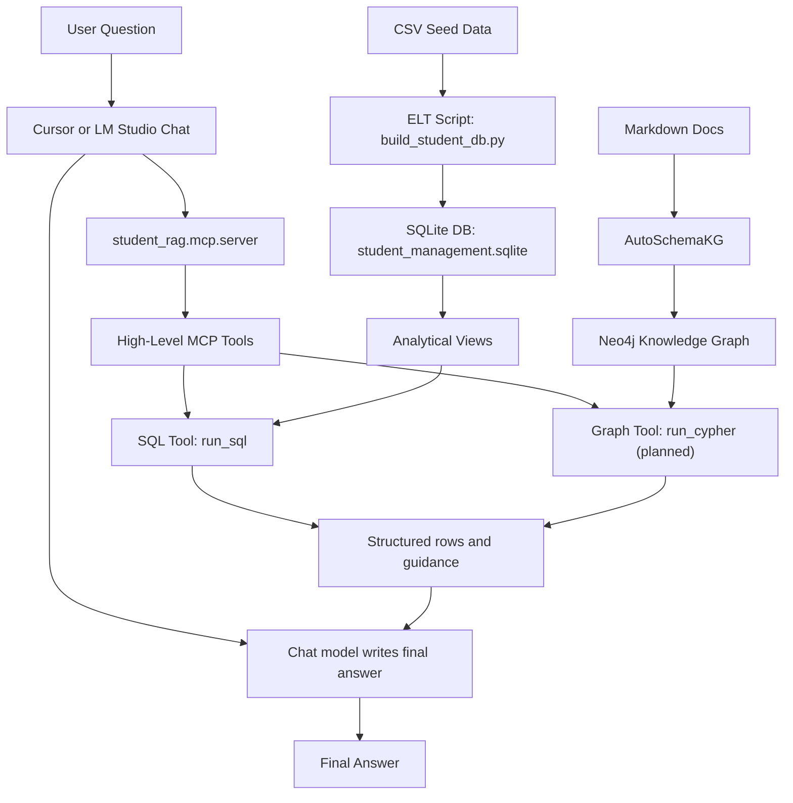
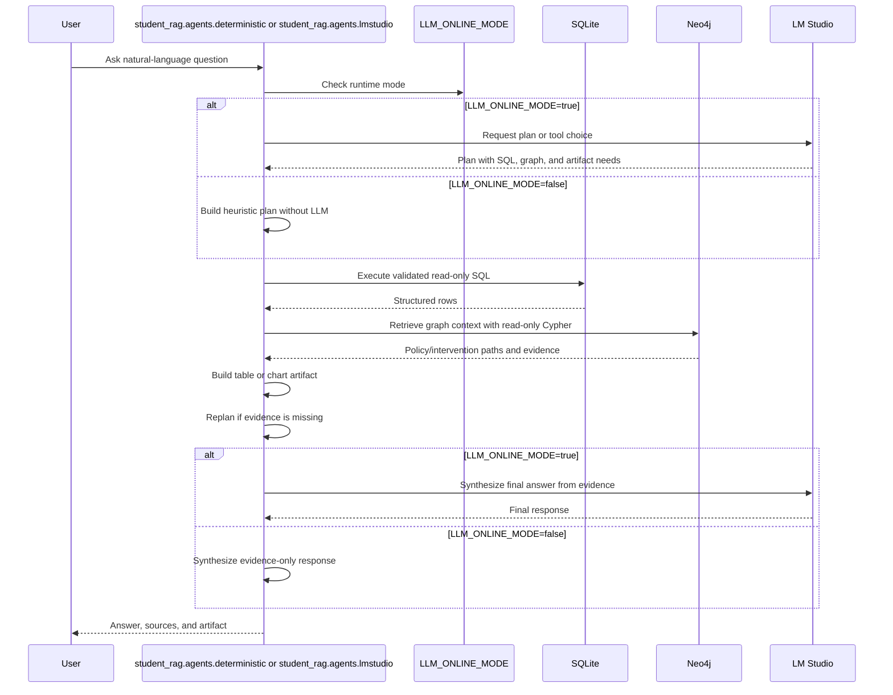
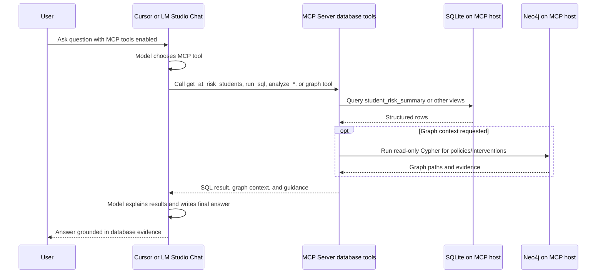
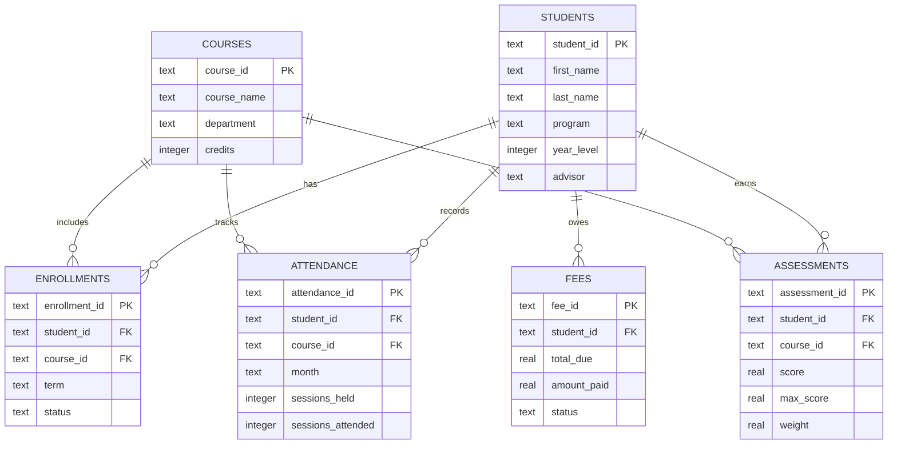
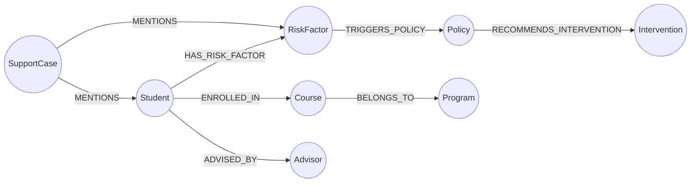

# Design: Student Management Agentic RAG

## 1. Purpose

This project is an advanced local showcase that shows how an agent can answer Student Management questions by combining:

- Structured data from SQLite.
- Knowledge graph facts extracted from unstructured documents with AutoSchemaKG and stored in Neo4j.
- Local answer generation through LM Studio.
- A simple workflow with planning, tool execution, table/chart output, replanning, and final synthesis.

The sample keeps SQLite for operational student records and uses Neo4j as the preferred graph store for the advanced knowledge-graph showcase. MCP remains a database-facing interface: it should query SQLite and, when graph support is added, Neo4j.

## 2. Scope

In scope:

- Build a local SQLite database from CSV source files.
- Build a Neo4j knowledge graph from Markdown documents using AutoSchemaKG.
- Answer natural-language questions with SQL evidence and graph evidence.
- Produce Markdown tables or Vega-Lite chart specs when useful.
- Run repeatable eval questions and append JSONL results.

Out of scope for the first version:

- User authentication.
- Multi-user database writes.
- Hosted databases.
- Production scheduling or orchestration.
- Full BI dashboard rendering.

## 3. Target Architecture

### 3.1 Python Agents (SQLite + Neo4j)



### 3.2 AutoSchemaKG + Neo4j Knowledge Graph



Neo4j is the preferred store for AutoSchemaKG output because the extracted facts are naturally graph-shaped: students, policies, interventions, risk factors, courses, advisors, and the relationships between them. This makes the showcase stronger than a document-search-only RAG demo and supports multi-hop questions such as "which policy and intervention path applies to this student?"

### 3.3 MCP (SQLite + Neo4j Database Tools — Cursor / LM Studio Chat)



Remote MCP (`student_rag.mcp.http_server`) follows the same database-tool path. Only the transport changes. MCP reads SQLite now and should also expose read-only Neo4j graph tools when the AutoSchemaKG graph is available.

## 4. Project Structure

```text
student_management_agentic_rag/
  data/
    student_management/
      *.csv
  docs/
  eval/
  scripts/
    build_student_kg.py          # CSV -> Neo4j builder
  src/
    student_rag/
      paths.py
      artifacts.py
      llm.py
      data/
        db.py
        policy_loader.py
      kg/
        extraction.py
        neo4j_store.py
      agents/
        deterministic.py
        lmstudio.py
      mcp/
        server.py
        http_server.py
  eval_student_run.py
  pyproject.toml
  requirements.txt
```

## 5. Main Components

### Source Data

Structured CSV files are stored under `data/student_management/`:

- `students.csv`
- `courses.csv`
- `enrollments.csv`
- `attendance.csv`
- `assessments.csv`
- `fees.csv`

Policy and advising content is stored as CSV under `data/student_management/`:

- `policy_rules.csv` — numeric thresholds used to build `student_risk_summary`
- `policies.csv`, `interventions.csv`, `risk_policy_links.csv`, `policy_intervention_links.csv`
- `advising_notes.csv`, `student_risk_factors.csv`, `student_interventions.csv`
- `courses.csv` includes a `description` column for course context

### SQLite ELT

`student_rag.data.db` contains the SQLite schema, ELT build function, schema summary, and safe read-only SQL execution. `student_rag.data.policy_loader` reads `policy_rules.csv` and generates the `student_risk_summary` view SQL at build time. `scripts/build_student_db.py` is a thin command wrapper that rebuilds `student_management.sqlite`.

The raw tables stay normalized. The script also creates analytical views that make agent-generated SQL simpler:

- `assessment_scores`
- `attendance_summary`
- `fee_summary`
- `student_risk_summary`
- `course_performance_summary`
- `attendance_trend`

`get_schema_summary()` includes value hints that are important for local models:

- `student_risk_summary.risk_level` thresholds come from `policy_rules.csv` at database build time.
- `student_risk_summary.scholarship_candidate` uses integer values: `1` means yes, `0` means no.
- `student_risk_summary.term` uses values such as `2026-Spring`; there is no `current_term` value.
- `fee_summary.status` uses text values: `paid`, `partial`, `overdue`.

### AutoSchemaKG + Neo4j Knowledge Graph

Graph facts are loaded from CSV files in `data/student_management/` and written to Neo4j by `scripts/build_student_kg.py`. Primary inputs:

- `policy_rules.csv`, `policies.csv`, `interventions.csv`
- `risk_policy_links.csv`, `policy_intervention_links.csv`
- `advising_notes.csv`, `student_risk_factors.csv`, `student_interventions.csv`
- `courses.csv`, `student_course_context.csv`, `course_policy_links.csv`

Recommended graph model:

- Nodes: `Student`, `Course`, `Policy`, `RiskFactor`, `Intervention`, `Advisor`, `Program`, `Department`, `SupportCase`
- Relationships: `ENROLLED_IN`, `HAS_RISK_FACTOR`, `TRIGGERS_POLICY`, `RECOMMENDS_INTERVENTION`, `ADVISED_BY`, `BELONGS_TO_PROGRAM`, `MENTIONED_IN`
- Evidence properties: `source_doc`, `evidence_text`, `confidence`, `term`

Example extracted facts:

- `Carlos Reyes` `HAS_RISK_FACTOR` `Irregular Attendance`
- `Irregular Attendance` `TRIGGERS_POLICY` `Attendance Intervention Policy`
- `Attendance Intervention Policy` `RECOMMENDS_INTERVENTION` `Weekly Lab Attendance`
- `Balance Due Greater Than 500` `TRIGGERS_POLICY` `Financial Hold Policy`

Planned modules:

- `scripts/build_student_kg.py`: loads graph facts from policy CSV files into Neo4j.
- `student_rag.kg.extraction`: builds graph facts from CSV seed files.
- `student_rag.data.policy_loader`: reads `policy_rules.csv` and generates risk view SQL.
- `student_rag.kg.neo4j_store`: creates constraints, loads nodes/edges, and runs read-only Cypher queries.

Planned Neo4j constraints:

```cypher
CREATE CONSTRAINT student_name IF NOT EXISTS FOR (s:Student) REQUIRE s.name IS UNIQUE;
CREATE CONSTRAINT policy_name IF NOT EXISTS FOR (p:Policy) REQUIRE p.name IS UNIQUE;
CREATE CONSTRAINT course_id IF NOT EXISTS FOR (c:Course) REQUIRE c.course_id IS UNIQUE;
```

### Agent Workflow

`student_rag.agents.deterministic` contains the deterministic workflow functions:

- `plan_question()` decides whether SQL, graph context, and chart output are needed.
- `decompose_query_request()` turns the plan into explicit workflow steps.
- `run_sql()` validates and executes one read-only SQLite query.
- Graph context functions run read-only Cypher against Neo4j for policy, intervention, and relationship evidence.
- `generate_table_or_chart_spec()` returns a Markdown table or Vega-Lite chart spec.
- `replan_if_needed()` runs a fallback query when SQL evidence is missing.
- `answer_from_evidence()` asks LM Studio to synthesize the final answer when `LLM_ONLINE_MODE=true`; if the LLM is unreachable in online mode, the agent reports an error instead of silently falling back.

`LLM_ONLINE_MODE` controls whether the Python agents use LM Studio:

- `LLM_ONLINE_MODE=true`: online mode. Planning and final synthesis require LM Studio. Connection failures are surfaced to the CLI as errors.
- `LLM_ONLINE_MODE=false`: evidence-only mode. The agent skips LM Studio and uses heuristic planning plus SQLite and Neo4j evidence. The CLI reports `Mode: offline_evidence`.

`student_rag.agents.lmstudio` is the Python API Tool Loop. A Python process calls LM Studio's OpenAI-compatible tool-calling API, lets the model choose tools each turn, executes the tools locally, and sends the tool results back to LM Studio for the final answer.

Exposed tools:

- `get_schema_summary` gives the model the SQLite tables, views, and columns.
- `run_sql` executes validated read-only SQL.
- Planned graph tools query Neo4j for policy paths, interventions, and risk-factor relationships. Neo4j is populated offline from Markdown documents by AutoSchemaKG.
- `generate_artifact` builds a Markdown table or Vega-Lite chart spec from the latest SQL result.
- If `LLM_ONLINE_MODE=false`, this path delegates to the deterministic evidence-only workflow. If `LLM_ONLINE_MODE=true`, tool-loop connection failures are reported as errors.

`student_rag.mcp.server` exposes structured-data tools for Cursor Chat and LM Studio Chat through MCP (local stdio or remote HTTP/SSE):

- `ask_student_management`
- `get_schema_summary`
- `run_sql`
- `get_at_risk_students`
- `analyze_at_risk_students`
- `get_scholarship_candidates`
- `analyze_scholarship_candidates`
- `generate_artifact`

The current MCP server reads **`student_management.sqlite` only**. In the Neo4j showcase version, MCP should access both databases: SQLite for operational student metrics and Neo4j for AutoSchemaKG-derived graph context.

Planned Neo4j-backed MCP tools:

- `get_student_graph_context(student_name)`
- `get_policy_intervention_path(student_name)`
- `get_related_risk_factors(student_name)`
- `query_knowledge_graph(cypher)`

`query_knowledge_graph` should be read-only and should only allow `MATCH`, `OPTIONAL MATCH`, `WITH`, `RETURN`, `ORDER BY`, `LIMIT`, and other non-mutating Cypher clauses.

`student_rag.mcp.http_server` exposes the same database-backed MCP tools over HTTP/SSE for remote clients. The remote MCP host needs `student_management.sqlite` for the current version and Neo4j connection settings when graph tools are enabled.

The high-level MCP tools reduce common model mistakes. For example, `get_scholarship_candidates` uses the correct condition `scholarship_candidate = 1` instead of relying on the model to guess whether the flag is `yes`, `true`, or `1`.

`analyze_*` MCP tools currently return the same structured rows as the matching `get_*` tools, plus metric interpretation guidance. In the Neo4j showcase version, they should also join graph context such as policy paths and intervention recommendations.

## 6. Runtime Flow

### 6.1 Deterministic And Python API Agents



### 6.2 Cursor Or LM Studio Chat MCP (Local Or Remote)



Remote MCP uses the same database-backed tool surface. Cursor or LM Studio on Machine B calls HTTP/SSE on Machine A. Machine A hosts SQLite and, in the advanced showcase, Neo4j.

## 7. Data Model Summary



### Neo4j Knowledge Graph Summary

The Neo4j graph stores document-derived knowledge extracted by AutoSchemaKG. It complements the relational student data instead of replacing it.



The graph should keep evidence metadata on relationships where possible:

- `source_doc`
- `evidence_text`
- `confidence`
- `term`

This allows graph answers to cite why a relationship exists, while SQLite remains the source for scores, attendance, balances, and risk levels.

## 8. Safety Rules

The SQL tool is intentionally conservative:

- Only one statement is allowed.
- SQL must start with `SELECT` or `WITH`.
- Mutating keywords such as `INSERT`, `UPDATE`, `DELETE`, `DROP`, `ALTER`, and `CREATE` are rejected.
- Results are capped by `MAX_SQL_ROWS`.
- SQL results can include warnings for suspicious value usage, such as `scholarship_candidate = 'yes'`.

This keeps the demo safe while still showing how an agent can use structured data.

Planned Neo4j/Cypher tools should follow the same principle:

- Only read-only Cypher is allowed.
- Mutating clauses such as `CREATE`, `MERGE`, `SET`, `DELETE`, `DETACH DELETE`, `REMOVE`, `DROP`, and `LOAD CSV` are rejected.
- Queries should be capped with a default `LIMIT`.
- Graph answers should include node labels, relationship types, and evidence metadata where available.

## 9. Evaluation

`eval/student_questions.json` contains representative questions:

- Student risk and intervention.
- Course performance weak areas.
- Scholarship support eligibility.
- Attendance trend chart generation.
- Policy and intervention path questions over Neo4j.
- Multi-hop graph questions connecting students, risk factors, policies, and interventions.

`eval_student_run.py` appends each run to `eval/student_results.jsonl` with the question, answer, plan, SQL, artifact type, and sources.

For LM Studio MCP answers (local or remote), evaluation should record which MCP tools were called.

For Neo4j showcase questions, evaluation should record:

- The Cypher query or graph tool used.
- The returned node labels and relationship types.
- Whether graph evidence is consistent with SQLite metrics.
- Whether the final answer distinguishes operational facts from graph-extracted document facts.

### Risk Answer Rubric

Risk answers should explain both high-risk triggers and medium-risk indicators.

High-risk triggers:

- `avg_score < 70`
- `attendance_pct < 75`
- `balance_due > 500`

Medium-risk indicators:

- `avg_score < 80`
- `attendance_pct < 85`
- `balance_due > 0`

`risk_reasons` is intentionally focused on high-risk reasons and can be empty for medium-risk students. An answer should not say a medium-risk student has "no reason" only because `risk_reasons` is empty. Instead, it should infer the medium-risk explanation from the metrics.

## 10. Generated Artifacts

These files are generated locally and ignored by git:

- `student_management.sqlite`
- Neo4j database volume or dump files
- `eval/student_results.jsonl`
- `__pycache__/`